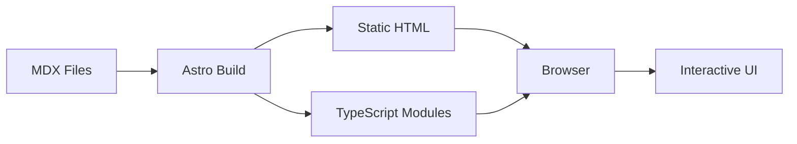

# Data Flow

## Content Pipeline

## Build-Time Flow

1. **Content Creation**
   - MDX files in `src/content/blog/`
   - Frontmatter metadata
   - Markdown content with components

2. **Processing**
   - Astro reads content collections
   - Parses frontmatter
   - Renders MDX to HTML
   - Optimizes images

3. **Output**
   - Static HTML pages
   - Optimized assets
   - TypeScript bundles

## Runtime Flow

1. **Initial Load**
   - Browser loads static HTML
   - CSS applies immediately
   - Page is readable

2. **Enhancement**
   - TypeScript modules load
   - Components initialize
   - Event handlers attach

3. **Interaction**
   - User triggers events
   - Components respond
   - UI updates dynamically

## State Management

Currently minimal state:
- Component-local state only
- No global store needed
- DOM as source of truth

## Future Considerations

- Add state management if needed
- API integration ready
- Real-time features possible