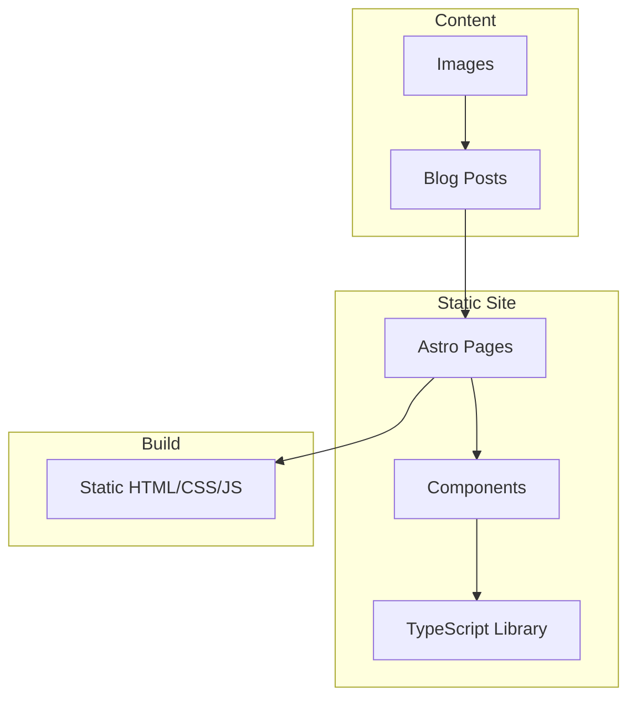

# Architecture Overview

Kilowhat is a minimal, typography-focused blog built with Astro and Tailwind CSS.

## Core Architecture



## Key Technologies

- **Astro v5.11.0** - Static site generator
- **TypeScript** - Type safety and better DX
- **Tailwind CSS v4.1.11** - Utility-first CSS
- **MDX** - Markdown with component support

## Architecture Principles

1. **Static First** - Pre-rendered HTML for performance
2. **Progressive Enhancement** - Works without JavaScript
3. **Type Safety** - TypeScript throughout
4. **Minimal Dependencies** - Only what's necessary
5. **Clean Separation** - Logic in TypeScript modules

## Directory Structure

```
src/
├── lib/          # TypeScript modules
├── components/   # Astro components
├── pages/        # Routes
├── content/      # Blog posts
└── styles/       # CSS files
```